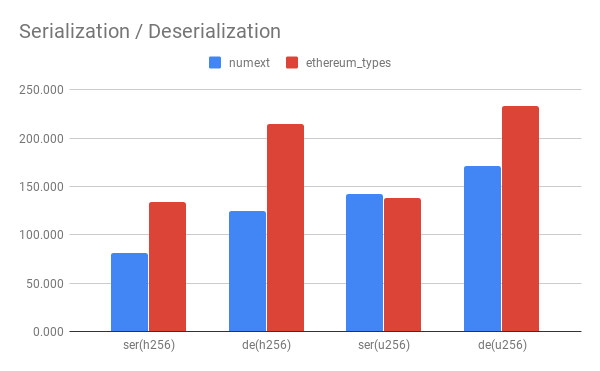
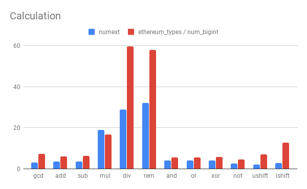

# Rust-NumExt

[![License]](#license)
[![Travis CI]](https://travis-ci.com/cryptape/rust-numext)

Extend the rust built-in numeric types.

[License]: https://img.shields.io/badge/License-Apache--2.0%20OR%20MIT-blue.svg
[Travis CI]: https://img.shields.io/travis/com/cryptape/rust-numext.svg

## Crates

| Name                   | Crate                                                               | Documentation                                            | Description                 |
| ---------------------- | ------------------------------------------------------------------- | -------------------------------------------------------- | --------------------------- |
| [`numext-constructor`] | [![Constructor Badge]](https://crates.io/crates/numext-constructor) | [![Constructor Doc]](https://docs.rs/numext-constructor) | Constructors (proc-macro).  |
| [`numext-fixed-uint`]  | [![Uint Badge]](https://crates.io/crates/numext-fixed-uint)         | [![Uint Doc]](https://docs.rs/numext-fixed-uint)         | Fixed-size uint structures. |
| [`numext-fixed-hash`]  | [![Hash Badge]](https://crates.io/crates/numext-fixed-hash)         | [![Hash Doc]](https://docs.rs/numext-fixed-hash)         | Fixed-size hash structures. |

[`numext-constructor`]: constructor
[`numext-fixed-uint`]: fixed-uint
[`numext-fixed-hash`]: fixed-hash

[Constructor Badge]: https://img.shields.io/crates/v/numext-constructor.svg
[Uint Badge]: https://img.shields.io/crates/v/numext-fixed-uint.svg
[Hash Badge]: https://img.shields.io/crates/v/numext-fixed-hash.svg

[Constructor Doc]: https://docs.rs/numext-constructor/badge.svg
[Uint Doc]: https://docs.rs/numext-fixed-uint/badge.svg
[Hash Doc]: https://docs.rs/numext-fixed-hash/badge.svg

## Benchmark

### Howto

```
cargo bench
```

### Results on Intel Core i7-7600U 2.80Ghz



Serialization / Deserialization Benchmark:
```
bench_ser_numext_h256         time:   [80.539 ns 81.158 ns 81.874 ns]
bench_ser_ethereum_types_h256 time:   [132.38 ns 134.38 ns 137.17 ns]

bench_de_numext_h256          time:   [123.57 ns 124.94 ns 126.56 ns]
bench_de_ethereum_types_h256  time:   [210.33 ns 214.40 ns 219.37 ns]

bench_ser_numext_u256         time:   [141.27 ns 142.24 ns 143.43 ns]
bench_ser_ethereum_types_u256 time:   [137.31 ns 138.07 ns 139.01 ns]

bench_de_numext_u256          time:   [168.25 ns 170.82 ns 173.99 ns]
bench_de_ethereum_types_u256  time:   [231.13 ns 233.15 ns 235.50 ns]
```



Calculation Benchmark:
```
gcd/nfuint              time:   [3.0834 us 3.0919 us 3.1021 us]
gcd/num_bigint          time:   [7.2154 us 7.2583 us 7.3239 us]

add/nfuint              time:   [3.4250 ns 3.4684 ns 3.5220 ns]
add/etypes              time:   [5.9195 ns 5.9588 ns 6.0070 ns]

sub/nfuint              time:   [3.4548 ns 3.4679 ns 3.4833 ns]
sub/etypes              time:   [6.1585 ns 6.1958 ns 6.2436 ns]

mul/nfuint              time:   [18.872 ns 18.970 ns 19.085 ns]
mul/etypes              time:   [16.560 ns 16.669 ns 16.799 ns]

div/nfuint              time:   [28.812 ns 29.008 ns 29.227 ns] 
div/etypes              time:   [59.537 ns 59.746 ns 59.998 ns]

rem/nfuint              time:   [31.835 ns 32.123 ns 32.449 ns]
rem/etypes              time:   [57.782 ns 57.968 ns 58.214 ns]

bitand/nfuint           time:   [4.0901 ns 4.1069 ns 4.1266 ns]
bitand/etypes           time:   [5.6663 ns 5.6931 ns 5.7259 ns]

bitor/nfuint            time:   [4.1592 ns 4.1731 ns 4.1895 ns]
bitor/etypes            time:   [5.6709 ns 5.6860 ns 5.7048 ns]

bitxor/nfuint           time:   [4.1648 ns 4.1708 ns 4.1768 ns]
bitxor/etypes           time:   [5.7477 ns 5.7812 ns 5.8264 ns]

not/nfuint              time:   [2.6808 ns 2.6959 ns 2.7208 ns]
not/etypes              time:   [4.5379 ns 4.5571 ns 4.5823 ns]

ushl511/nfuint          time:   [2.0350 ns 2.0450 ns 2.0586 ns]
ushl511/etypes          time:   [7.2440 ns 7.3498 ns 7.4599 ns]

ushr511/nfuint          time:   [2.2099 ns 2.2161 ns 2.2243 ns]
ushr511/etypes          time:   [6.7501 ns 6.8263 ns 6.9176 ns]

ishl65/nfuint           time:   [2.8803 ns 2.9182 ns 2.9591 ns]
ishl65/etypes           time:   [12.777 ns 12.829 ns 12.896 ns]

ishr65/nfuint           time:   [2.8822 ns 2.9640 ns 3.0588 ns]
ishr65/etypes           time:   [12.854 ns 12.883 ns 12.920 ns]
```

## License

Licensed under either of [Apache License, Version 2.0] or [MIT License], at
your option.

[Apache License, Version 2.0]: LICENSE-APACHE
[MIT License]: LICENSE-MIT
